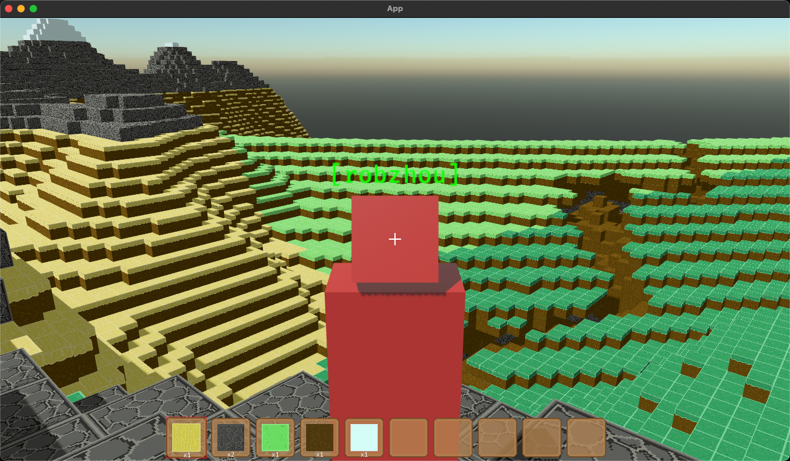
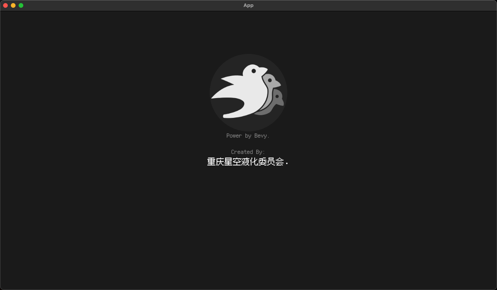
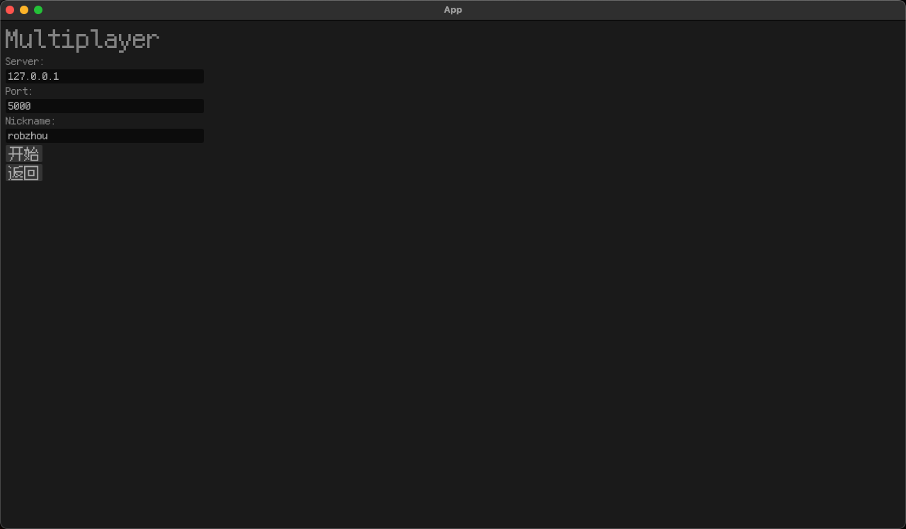
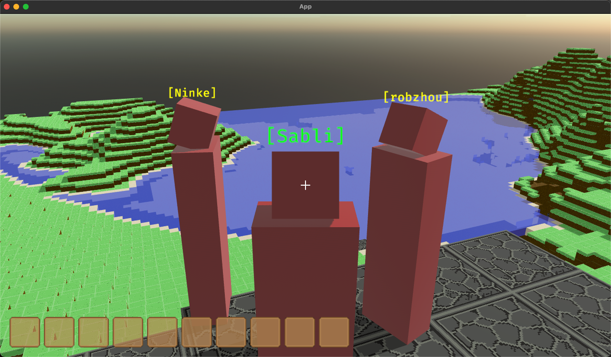
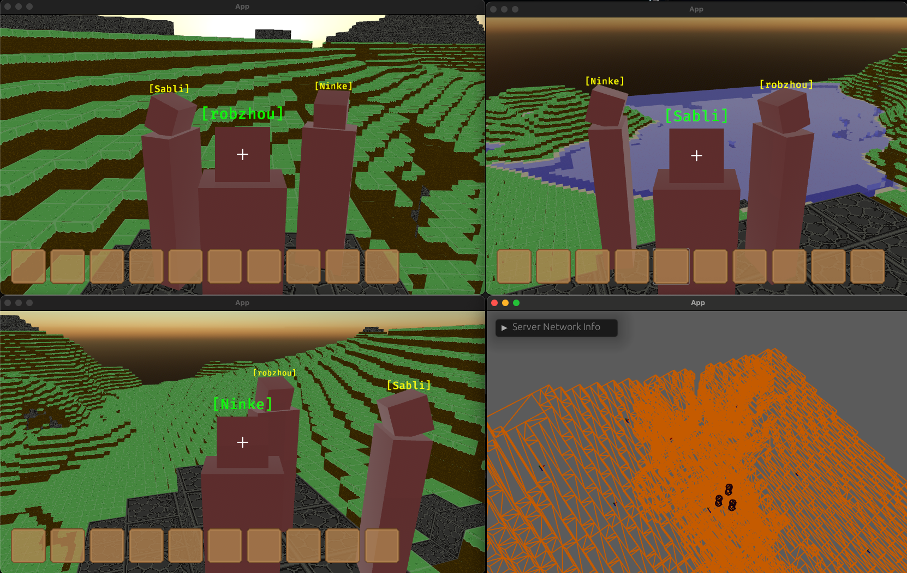

# Just Join (来噻)



----

this rep is rebuild from https://github.com/zzhgithub/just_join. The goal is to make the original project support the online multiplayer game

> ~~Ka Le on windows i5 cpu. optimizing!~~

# Usage
For Server
```shell
cargo run --release --bin server
# or
cargo run --release --no-default-features --features headless --bin server
```


For Client
```shell
cargo run --release --bin client
```

# Src/lib.rs Const 
```rust
// generate map every time when you restart game(use in test mode)
// Before game you should set to flase
pub const CLIENT_MAP_GEN: bool = true;
```


# Controller
- W - forward
- S - backward
- A - left
- D - right
- Space - Jump
- ESC - toggle grab cursor
- T - toggle One/Thrid Person
- E - Open composite rules list
- Q - throw active toolbar object
- (Hold Left-Shift Left-Click)-rotation Cube Direction

# Feature List
- [x] Load unlimited maps
  - [ ] support more biomes
- [x] Loading different materials for voxels
  - [ ] More block support 
  - [ ] support more entities in game(like grass or animals)
- [x] Load water
  - [ ] better water displaying
- [x] online multiplayer game(fundationally)
  - [x] display username
  - [x] save players last position stuff
  - [ ] sign in with username and password
  - [ ] chat system
  - [ ] range voice
- [x] load character 
  - [ ] better character models
  - [ ] actions and expression face system
  - [ ] Equipment system
  - [ ] knapsack system
  - [ ] Survival Mode
- [ ] UI
  - [x] toolbar
  - [ ] knapsack system
  - [ ] multiplayer show
  - [ ] on time map
- [x] composite system
  - [ ] opmtimize UI（Show current toolbar and knapsack）
  - [ ] support search
  - [ ] add more formula
- [x] more biomes support
  - [ ] decorate_terrain
- [ ] task system
- [ ] manor system
- [ ] wind zone
- [ ] support load mod and interface doc
  - [ ] furniture mod
- [x] i18n
- [ ] Tools
  - [ ] tp commands
- [ ] optimize
  - [ ] net optimize (such as lz4)


# screenshot


<!--  -->

